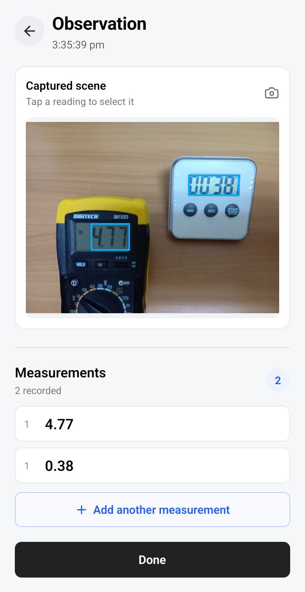

# SceneLog

SceneLog is a mobile app for recording observations from the physical world.

It is designed with laboratory and experimental work in mind, where measurements and instrument readings often need to be captured alongside the physical setup in which they were taken. It is not limited to laboratory use, however, and can be used wherever observations of the physical world need to be recorded and organized.

Capture a scene with the camera, use on-device OCR to identify readings, review the recognized text and extracted numeric value, edit the value if necessary, and build a collection of measurements within an observation.

The project is being developed with an emphasis on clear domain modelling, local persistence, and a practical mobile workflow.

## Current status

**v0.2 — Core observation workflow**

SceneLog currently supports capturing and reviewing observations with OCR-derived or manually entered measurements, local persistence, and deletion.

## Features

- Create observations from the camera
- Capture and persist the associated image locally
- On-device OCR using ML Kit
- Display detected text regions over the captured image
- Select an OCR result by tapping its region
- Show the OCR pipeline explicitly:
  - Recognized text
  - Numeric value extracted from the text
  - Editable value
- Manually enter a value when OCR does not produce a usable result
- Record multiple measurements in a single observation
- Review completed observations
- Persist observations and captured images locally
- Restore observations after restarting the app
- Delete observations and their associated stored images
- Confirmation before destructive deletion

## Example workflow

```text
Capture scene
     ↓
Detect text with on-device OCR
     ↓
Select a reading
     ↓
Recognized text → Numeric value
     ↓
Edit if necessary
     ↓
Save measurement
     ↓
Add additional measurements
     ↓
Complete observation
```

## Technology

- **React Native**
- **Expo SDK 57**
- **TypeScript**
- **Expo ML Kit OCR**
- **Expo FileSystem**
- **AsyncStorage**
- **Jest / jest-expo**

The application currently uses local device storage rather than a backend.

## Architecture

SceneLog separates the core observation model from application services and UI. The core domain currently consists of:

- **Observation** — a recorded unit of collected information.
- **Capture** — an individual interpretation/input within an observation.
- **FieldValue** — a numeric value associated with a field definition.
- **Field** — identifies the meaning of a value. The current implementation uses a built-in value field.

The domain is intentionally more general than the current UI. The initial interface presents a simple measurement workflow while the underlying model provides room for future observation types and richer templates.

## Local storage

Observations are serialized before being stored locally. Dates are represented as ISO 8601 strings in persisted data and reconstructed as `Date` objects when loaded.

Captured images are copied from their temporary camera location into the application's private document storage. A capture retains the stored source image URI, allowing the image to remain available after the original camera result is gone.

Deleting an observation also removes its associated stored image.

## Testing

The current test suite covers:

- Observation creation
- Capture creation
- Built-in field definition
- Observation serialization and deserialization
- Observation persistence
- Image storage
- Image deletion

## Roadmap

Future work may include:

- More flexible templates for different kinds of scenes and data
- User-defined fields
- Additional capture types
- Richer observation metadata
- Improved scene/measurement relationships
- Public project sharing
- Additional OCR and interpretation workflows

The roadmap is deliberately open-ended; future features will be added only when they fit the underlying observation model and provide a useful workflow.

## Project goals

SceneLog's goals are to demonstrate:

- Practical React Native development
- TypeScript domain modelling
- Native mobile capability integration
- On-device machine-learning/OCR integration
- Persistent local data management
- Separation between domain logic, services, and presentation
- Automated testing
- Incremental development with focused commits

## Screenshots

### Measurement capture

<p align="center">
  
</p>
